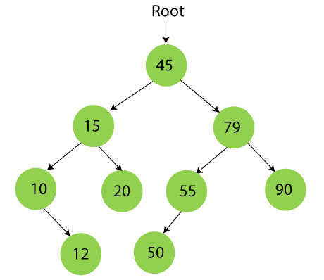

    

  

  

# binary-search-tree
> A set of idiomatic implementations of a binary-search tree in multiple languages.

Current version: **1.0.0**

## 📋 Table of content

- [Description](#-description)
- [Implementations](#-implementations)
- [See also](#-see-also)

## 🔰 Description

This repository contains idiomatic implementations of a [Binary Search Tree](https://en.wikipedia.org/wiki/Binary_search_tree) in multiple programming languages. The purpose of this repository is purely educational and allows to introduce a binary search tree recursive data structure, as well as its many implementation details across multiple languages.

A binary search tree is a tree data structure that can store arbitrarily typed data by enforcing the following properties :

- The left subtree of a node contains only nodes with keys lesser than the node’s key.
- The right subtree of a node contains only nodes with keys greater than the node’s key.
- The left and right subtree each must also be a binary search tree.
- It doesn't have any duplicate nodes.

A binary search tree supports operations like `search`, `insertion`, `deletion`, `min-max search`, in `O(h)` time where `h` is the height of the tree. Below is an example of the structural organization of elements in a binary search tree.

  

  

  

## ✏️ Implementations

This repository contains implementations in the following languages.

> Click to access a particular implementation 👇.

 
<table align="center">
  <thead>
    <tr>
      <th>Python</th>
      <th>Typescript</th>
      <th>C</th>
      <th>C++</th>
      <th>Kotlin</th>
    </tr>
  </thead>
  <tr>
    <td></td>
    <td></td>
    <td></td>
    <td></td>
    <td></td>
  </tr>
</table>
 

## 👀 See also

- The [Binary Search Tree](https://en.wikipedia.org/wiki/Binary_search_tree) Wiki page.
- [Convert](https://www.geeksforgeeks.org/convert-normal-bst-balanced-bst/) a Binary Search Tree into a balanced tree.
